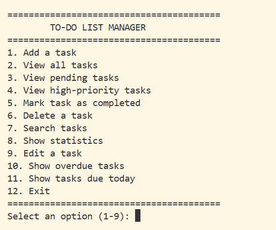
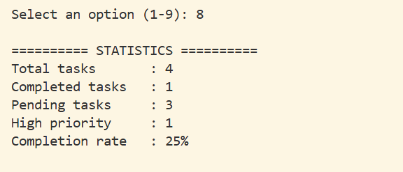

# CloudExify Python Month 2 — Project 4
# To-Do List Manager

**Name:** SANA EJAZ  
**Registration Number:** CX-INT-2026-PY-0031  
**Internship:** CloudExify Python Internship 2026  
**Project:** Project 4 — Final Project

## Project Description

The To-Do List Manager is a Python command-line productivity application developed as the final project of the CloudExify Python Internship.

The program allows users to create, manage, search, update, complete, and delete tasks. Tasks are stored in a JSON file so that the data remains available when the program is run again.

The project uses Python's built-in `json` and `datetime` modules.
## Features

### Required Features

- Add new tasks
- Assign task priority
- Set a due date
- Automatically record task creation time
- View all tasks
- View pending tasks
- View high-priority tasks
- Mark tasks as completed
- Delete tasks with confirmation
- Display task statistics
- Save tasks to a JSON file
- Load saved tasks when the program starts

### Bonus Features

All five bonus challenges from the project guide were implemented:

- Search tasks by keyword in the title
- Edit task title or priority
- Show overdue tasks
- Show tasks due today
- Add task categories:
  - Work
  - Study
  - Personal
## Technologies Used

- Python 3
- JSON
- datetime
- Command Line Interface (CLI)
## Project Structure

```text
CloudExify-Project-4
│
├── todo_manager.py
├── tasks.json
├── README.md
└── screenshots
    ├── screenshot1.png
    └── screenshot2.png
```

## How to Run

1. Make sure Python 3 is installed on your computer.
2. Download or clone this repository.
3. Open the project folder in Visual Studio Code.
4. Open the terminal.
5. Run the following command:

```bash
python todo_manager.py
```

6. Use the menu options to manage your tasks.

---

## Data Storage

Tasks are stored in the `tasks.json` file.

The program saves task information to JSON and loads the saved tasks when the program starts.

---

## Testing

The project was tested for the following functions:

- Adding a task with all fields
- Adding a task with an empty title
- Viewing all tasks
- Viewing pending tasks
- Viewing high-priority tasks
- Marking a task as completed
- Handling an already completed task
- Deleting a task with confirmation
- Canceling a task deletion
- Viewing statistics
- Restarting the application and loading saved tasks
- Searching tasks by keyword
- Editing task title or priority
- Showing overdue tasks
- Showing tasks due today
- Adding task categories

---

## Screenshots

### Screenshot 1 — Running Program



### Screenshot 2 — Statistics



---

## GitHub Links — All 4 CloudExify Projects

### Project 1 — Personal Expense Tracker

https://github.com/sanaejaz4212-hub/CloudExify-Project-1.git

### Project 2 — Student Grade Management System

https://github.com/sanaejaz4212-hub/CloudExify-Project-2.git

### Project 3 — Python Quiz Game

https://github.com/sanaejaz4212-hub/cloudexify-python-p3-sana.git

### Project 4 — To-Do List Manager

https://github.com/sanaejaz4212-hub/cloudexify-python-p4-sana
